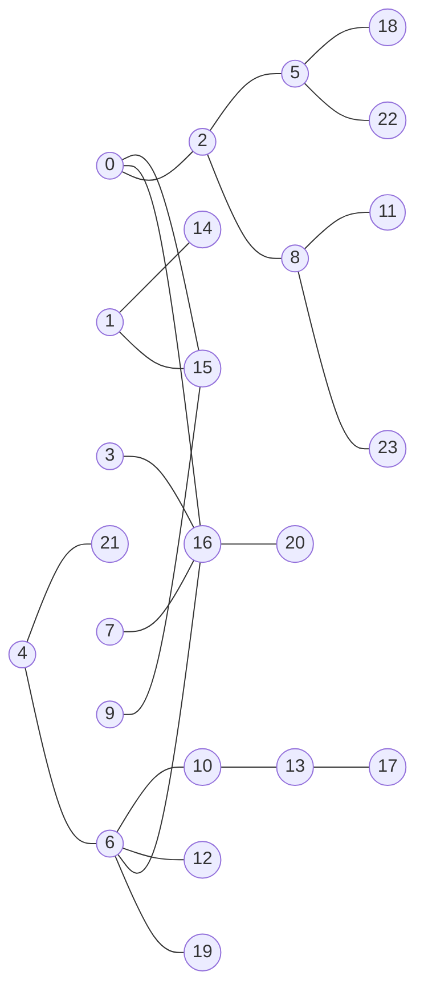

```mermaid
graph LR;
  0((0))
  1((1))
  2((2))
  3((3))
  4((4))
  5((5))
  6((6))
  7((7))
  8((8))
  9((9))
  10((10))
  11((11))
  12((12))
  13((13))
  14((14))
  15((15))
  16((16))
  17((17))
  18((18))
  19((19))
  20((20))
  21((21))
  22((22))
  23((23))
  0 --- 15
  0 --- 16
  0 --- 2
  1 --- 14
  1 --- 15
  10 --- 13
  13 --- 17
  16 --- 20
  2 --- 5
  2 --- 8
  3 --- 16
  4 --- 21
  4 --- 6
  5 --- 18
  5 --- 22
  6 --- 10
  6 --- 12
  6 --- 16
  6 --- 19
  7 --- 16
  8 --- 11
  8 --- 23
  9 --- 15
```
